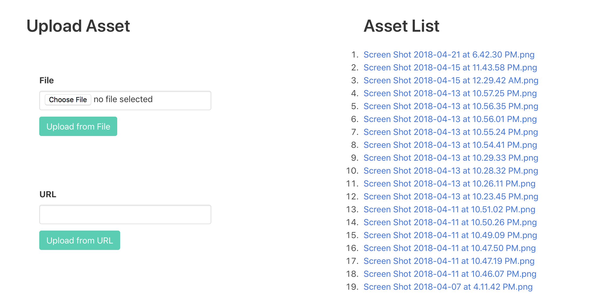

# S3 files uploader

Basic web app to upload files to an S3 bucket. It also lists the files under the
bucket.



## Requirements

- [Clojure 1.9 CLI](https://clojure.org/guides/getting_started)

## How to use

This app makes use of the [yogthos/config](https://github.com/yogthos/config)
library to get the necessary configuration. One possible way to configure the
app is to create a file called `config.edn` under the `src` folder, with the
following contents:

```
{:access-key "<aws access key>"
 :secret-key "<aws secret key>"
 :endpoint "<aws default region>"
 :bucket "<bucket name>"}
```

Next, run the app with `clojure -e "(go)"`, which will be available at
http://localhost:3000

## Status

Functional but no security, currently it is better to run this on localhost. All
files uploaded from this app are given public access.

## License

Distributed under the Eclipse Public License, the same as Clojure.
